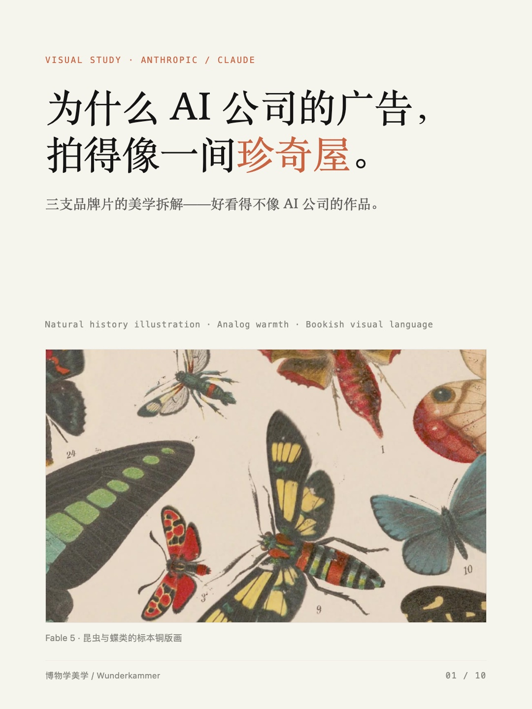
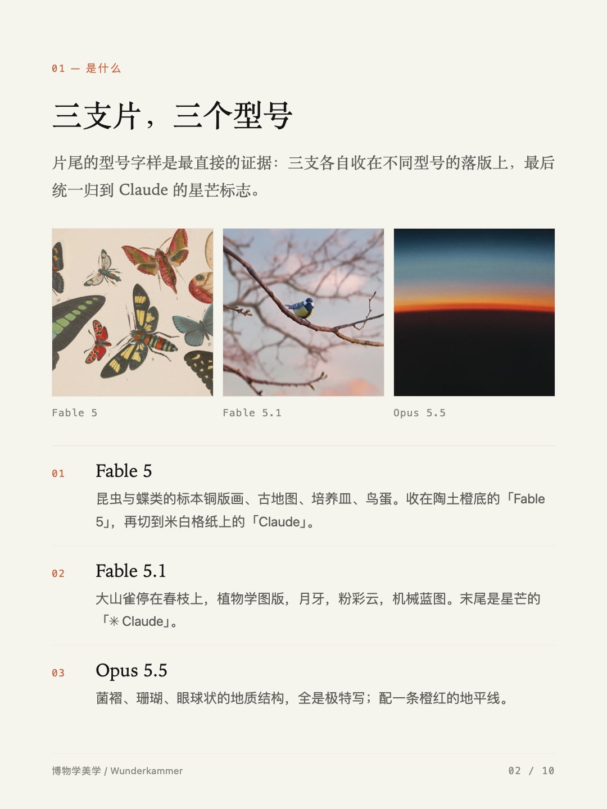
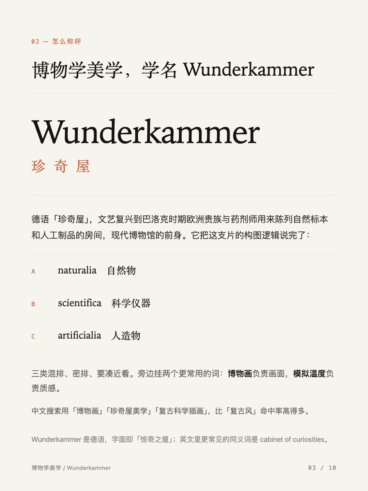
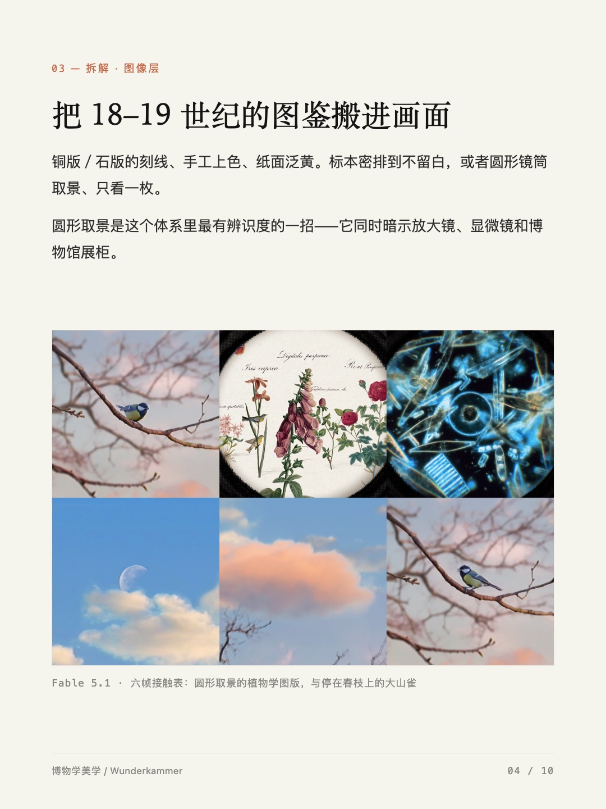
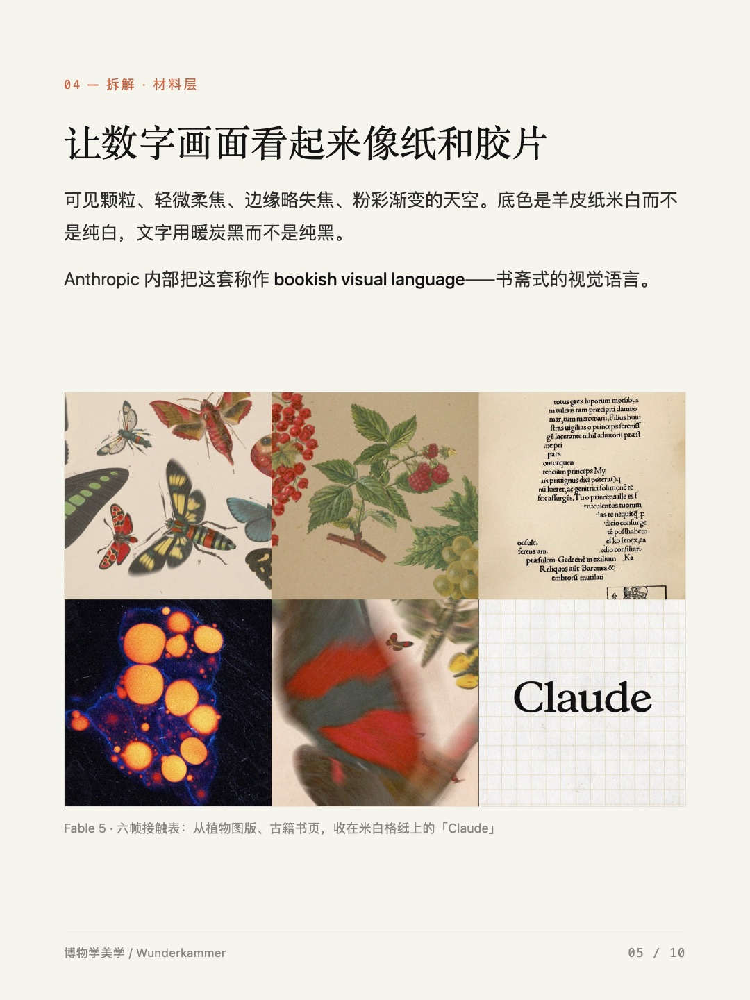
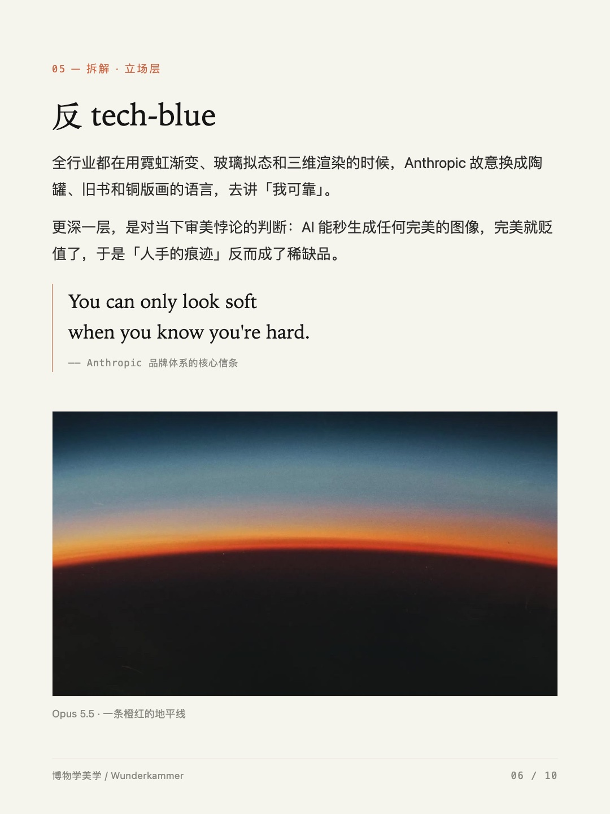
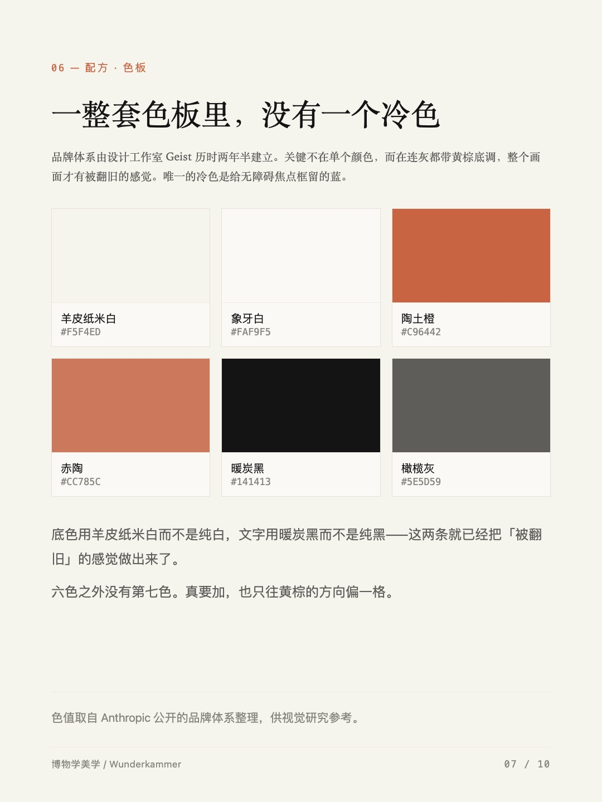
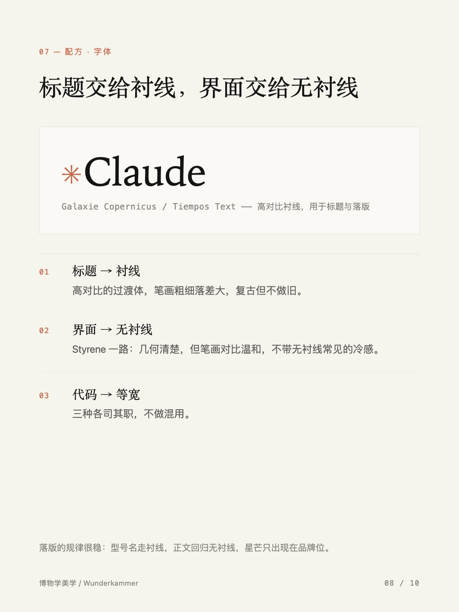
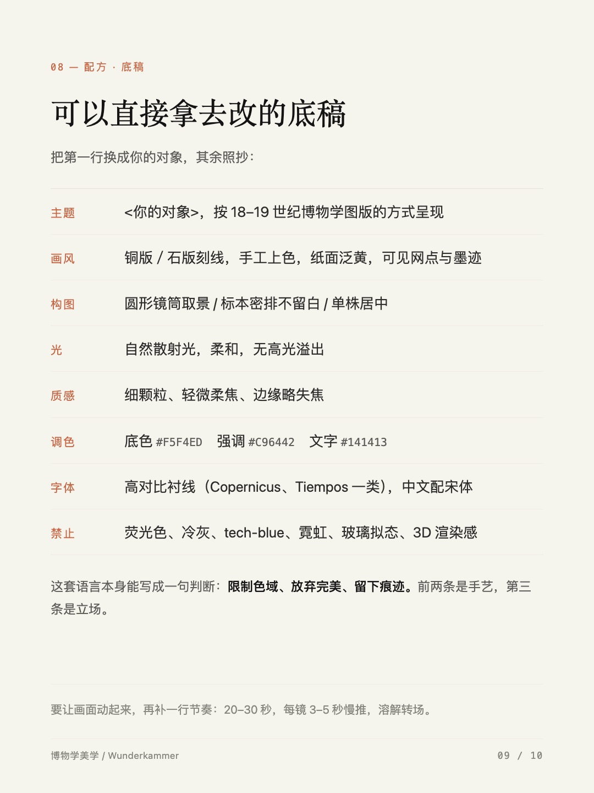
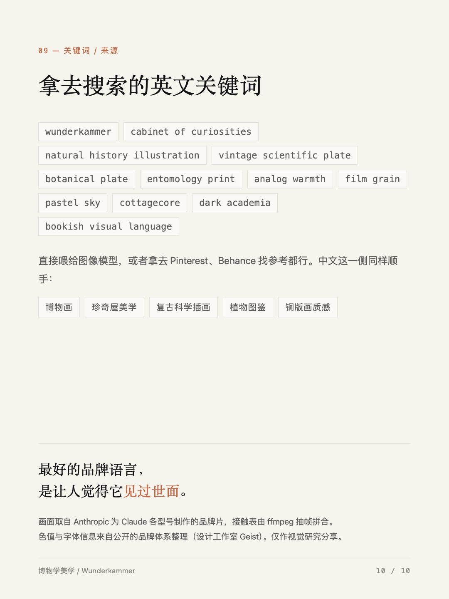

**中文** | [English](README.en.md)

# editorial-carousel

把一篇文章、一份拆解、一段资料，排成一组**人文编辑风**的小红书图文笔记。

用 HTML/CSS 落版 → 无头 Chrome 逐页截图成 1080×1440 → 配一份可直接粘贴的纯文本文案。
视觉语言是杂志内页式的：羊皮纸底、衬线标题、细规线、图注、栏头、页码、大留白。

适合**文字量偏多**的内容——长文拆解、资料整理、设计分析、读书笔记。
不适合纯图形示意和清单（那是另一个工具的事）。

---

## 效果

以下 10 张全部由本 skill 产出，未做后期：

<table>
<tr>
<td width="50%"><br><sub>01 封面 · 一句话结论 + 一张主视觉</sub></td>
<td width="50%"><br><sub>02 三联条目 · 三个对象并列</sub></td>
</tr>
<tr>
<td width="50%"><br><sub>03 大字词页 · 一页只讲一个术语</sub></td>
<td width="50%"><br><sub>04 图文页 · 论述 + 证据图</sub></td>
</tr>
<tr>
<td width="50%"><br><sub>05 图文页 · 图在剩余空间里居中</sub></td>
<td width="50%"><br><sub>06 引文页 · 立场与态度</sub></td>
</tr>
<tr>
<td width="50%"><br><sub>07 色板 · 给读者的可复制参数</sub></td>
<td width="50%"><br><sub>08 字样样板 · 字体搭配</sub></td>
</tr>
<tr>
<td width="50%"><br><sub>09 配方 · 能直接抄走的参数表</sub></td>
<td width="50%"><br><sub>10 收尾 · 关键词 + 结语 + 来源</sub></td>
</tr>
</table>

> 案例背景：拆解 Anthropic 三支品牌片的博物学视觉语言。`examples/naturalist-visual-study/`

---

## 它做什么

| | |
| --- | --- |
| **出图** | 1080×1440（3:4）竖版组图，一次 8–12 张，文件名即上传顺序 |
| **落版** | 9 种页型的完整 CSS 骨架，改文字就能用 |
| **出文案** | 标题三选一 + 纯文本正文，直接粘进小红书编辑器 |
| **可重出** | 改了某一页只重出那一页，不用整套重跑 |

**不做**：不生成图片素材（图要自己准备），不做动图/视频，不做竖版长图拼接。

---

## 用法

### 安装

放到 skill 目录即可，两种位置选一个：

```bash
# 用户级（所有项目可用）
git clone https://github.com/voidning/editorial-carousel.git \
  ~/.workbuddy/skills/editorial-carousel

# 或项目级
git clone https://github.com/voidning/editorial-carousel.git \
  <项目>/.workbuddy/skills/editorial-carousel
```

### 每期流程

1. **定结论与页序** —— 先写出一句话结论（能直接当封面副标题），再按页型库排出页序，每页一句话。
2. **落版** —— 复制 `assets/base.html` 到工作目录，删掉用不到的页型，填内容。图片先压到 1080–1600 宽。
3. **出图**
   ```bash
   bash assets/render.sh 版式.html ./out 10          # 出 10 页
   PAGES=3,9 bash assets/render.sh 版式.html ./out 10  # 只重出第 3、9 页
   ```
4. **自检** —— 生成缩略图逐页看，重点查溢出、裁切、断行、中部空洞。
   ```bash
   for f in out/*.png; do sips -s format jpeg -s formatOptions 74 --resampleWidth 620 \
     "$f" --out "/tmp/preview-$(basename "$f" .png).jpg"; done
   ```
5. **文案** —— 按 `references/publishing.md` 出纯文本标题与正文。

---

## 目录

```
SKILL.md                      触发描述、流程、硬规则
assets/base.html              9 种页型的完整版式骨架 + 多格布局类（全部 CSS）
assets/render.sh              批量出图，支持只重出指定页
references/layout-rules.md    字号基准表、页型选择路由、留白与断行、自检清单
references/publishing.md      图片规格、纯文本文案规范、合集判断、发布后修改边界
examples/                     成品案例
```

---

## 硬规则（都是踩过的坑）

**内容层**

- **页序里必须有一页回答「为什么」。** 把页分成「描述画面」和「解释意图」两类，**解释页为 0 就是没做完**——描述页再多也不产生说服力，读者读完只记得"画面很怪"。找「为什么」的顺序：先找**文字证据**（字幕、文案、型号命名），设计意图常常就是它的直译；再找**破例处**（通例是什么、这一支破了哪条），破例即意图。
- **只提供观察、不推进论证的页不要单独成页**（典型是取样色卡）。那是装饰，占一整页等于摊薄节奏，信息并进相邻页或配方页即可。
- **图文承诺必须一致。** 文案说"三个细节"，图里就要有三个对应页；文案指向第 N 张，那张就必须还在——**删页或加页时同步改文案**，否则读者翻回去数不出来。
- **计数与顺序都要自洽。** 标题说"六格"而正文只列出 5 种、正文枚举顺序与图版顺序相反——这两种错读者都会去对。图注里"按顺序""一一对应"这类话是承诺，写了就得兑现，宁可不写。
- **讲配色时色值从画面取样，不要引用二手色卡。** 对关键帧的目标区域做区域平均，给出的才是这支片真实用到的；取样过程本身经常直接产出论点。
- **发布前核查事实，别靠印象。** 型号名、发布时间、时长、台词原文都要验一遍。本机没有 `ffprobe`，可用 `mdls -name kMDItemDurationSeconds <视频>` 读真实时长——**以文件为准，不信平台分类标签**。

**排版层**

- **无头截图必须加 `--no-sandbox`**。不加时 Chrome 的子进程被外层拦掉，**截图静默不生成**——退出码 0、输出目录空，极易误判成路径写错。`render.sh` 已带上。
- **正文不要低于 26 px**（1080 宽基准）。20 px 在手机上只剩 7 pt 左右。字号一加大必然溢出，必须逐页重看并相应减字或拆页，**不要靠缩字把内容塞进一页**。
- **含中文的元素不能设等宽字体**。`SF Mono` 一类没有 CJK 字形，中文要靠字体栈回退，表现为字距突然变大、字重不匀。中文标签统一加 `.zh` 切回 sans。
- **有原始比例的图别设固定高度**，会裁掉内容。用 `.media` 包裹让它在剩余空间里自动居中。
- **多格组合图（三格、两格、六格）不要放进 `.media`**：`.media .plate img{height:auto}`（权重 0,2,1）会盖掉 `figure img{height:100%}`（0,0,2），固定高度的格子会被原图比例撑破、裁切失效。用 `base.html` 里现成的 `.triptych` / `.duo` / `.grid6`（守护规则已内置），每个格子用内联 `height` 定高。
- **不要出现"中部空洞"**：文字在上、图用 `margin-top:auto` 顶到底，中间会空 250 px 以上，看起来像没排完，与"没排完"确实没区别。图片页用 `.media`，文字页用 `.note` 贴底收束。
- **正文必须是纯文本**：小红书不解析 markdown，`**加粗**`、`> 引用`、`- 列表` 粘进去就是字面符号。层次靠空行和小节符（`▍`、`—`）做。
- **不要手动给出图文件改名**。`render.sh` 输出 `0X.png`，改名后再重出会生成新的 `0X.png` 与旧文件并存，很容易把旧图当新图交付。要语义化命名就改脚本里的 `printf`，或统一在最终交付前批量改一次。
- **交付顺序**：先出图给用户看，再给文案。

---

## 环境要求

- macOS（依赖 `sips` 压缩图片；`render.sh` 里 Chrome 路径可按需改 `CHROME` 环境变量）
- Google Chrome（无头模式出图）
- `python3`（注入页面位移）
- 字体栈优先 `Tiempos Text` / `Iowan Old Style` / `Palatino`，中文回退 `Songti SC` → `Source Han Serif SC`。没有衬线字体时回退到系统默认，观感会降一档。

---

## 授权

代码与文档 MIT。`examples/` 中的案例图是对公开品牌广告的**评论性引用**（画面素材版权归原作者），仅作工具效果示例，不商用。

案例中的分析文本、配色与排版结构可自由取用。
